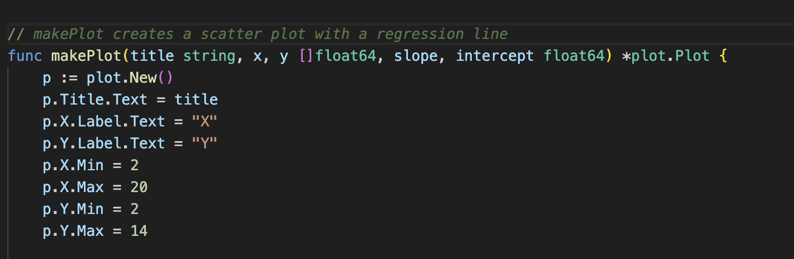
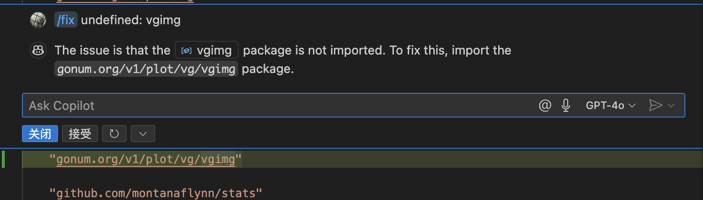
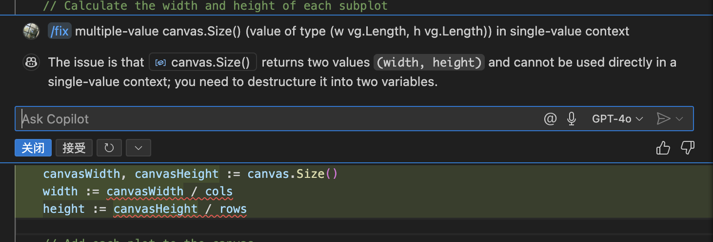
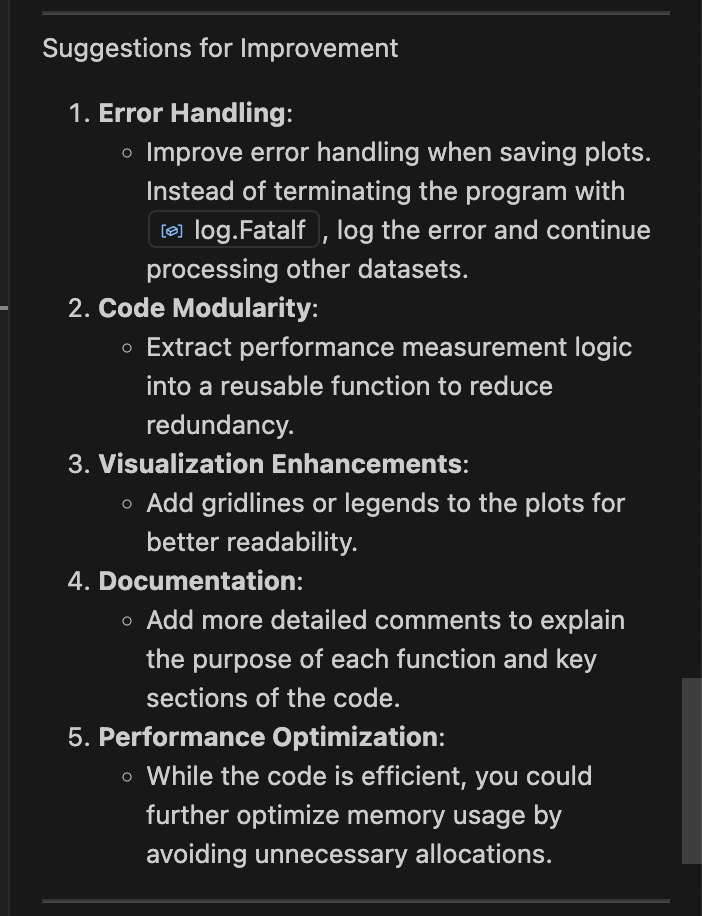
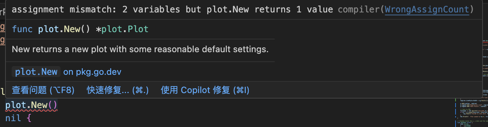
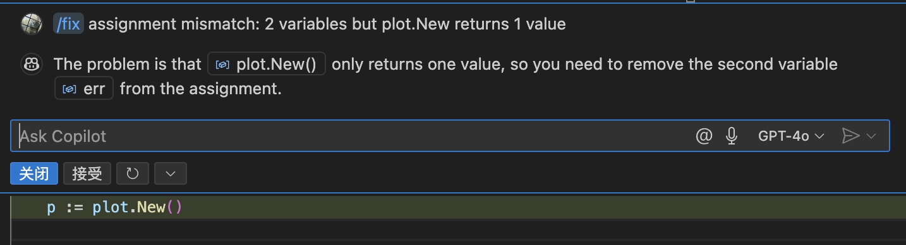

# AI-Driven Programming Evaluation

This project investigates the practical use of AI-assisted and AI-generated code in Go programming, particularly focusing on implementing linear regression analysis of the Anscombe Quartet. The goal is to assess whether automation can reduce software development workload and cost in a startup environment.

## 1. AI-Assisted Programming (GitHub Copilot)

While working on this project, I found GitHub Copilot to be more effective than ChatGPT or Gemini for **real-time code editing and review**. Because Copilot is embedded directly into VS Code, it has full access to the entire codebase context, which allows it to provide more relevant and immediate suggestions.

There were three key features I found particularly helpful:

1. **Inline Documentation Suggestions**: When I typed `//` followed by a short phrase, Copilot generated complete and readable comments that improved the clarity of my code. This was especially useful for making the logic understandable to other readers.

2. **Debugging Guidance**: When bugs appeared, clicking on the highlighted error in VS Code often triggered Copilot to offer meaningful suggestions for fixes. This streamlined the debugging process significantly and reduced the time spent resolving issues.

3. **Code Autocompletion for Task-Specific Comments**: For example, when I typed `// Define the Anscombe Quartet datasets.`, Copilot automatically generated a relevant block of code that matched the intended purpose. This was particularly useful for repetitive or boilerplate sections of the program.

Overall, Copilot served as an effective assistant for enhancing code readability, reducing manual work, and accelerating common development tasks. It was especially valuable in scenarios where the logic was already known and needed to be translated into Go syntax efficiently.

## 2. AI-Generated Code

To evaluate the capabilities of large language models (LLMs) in generating Go code, I used ChatGPT (https://chat.openai.com/) to prompt the full implementation of linear regression analysis on the Anscombe Quartet. The full conversation and results are documented in the file [Download ChatGPT-Go Anscombe Regression Analysis (PDF)](./ChatGPT-Go%20Anscombe%20Regression%20Analysis.pdf)

### Prompting Strategy

The process began with a clear and structured prompt: I instructed ChatGPT to:

- Use all four datasets from the Anscombe Quartet.
- Calculate slope, intercept, R-squared, residual standard error, and F-statistic.
- Measure execution time and memory usage.
- Use idiomatic Go without external dependencies.
- Structure the program modularly for reuse and testability.

ChatGPT responded by outlining a step-by-step plan, which included dataset setup, modular function definitions, benchmarking logic, and final formatted output. Once I gave permission to proceed, it generated the entire `main.go` file according to best practices.

### Bug Encountered and Hybrid Approach

Although the generated Go code was mostly correct, there was a bug in the plotting section using `gonum/plot`. Specifically, `plot.New()` was initially treated as returning two values (`p, err := plot.New()`), but the latest version of the library only returns one. This caused a compilation error. 

Interestingly, GitHub Copilot helped solve this issue more efficiently than ChatGPT. Because Copilot was embedded in my VS Code environment, it had full visibility of my import statements and Go module versions. Copilot immediately suggested the correct syntax (`p := plot.New()`), which resolved the issue.

### Summary of Results

- **ChatGPT** was excellent for initial code generation, documentation, and modular structure.
- **Copilot** was better at understanding the full context of the codebase and proposing inline fixes, especially for dependency-related issues.

Combining both tools significantly accelerated development and debugging. I found that using ChatGPT for structured code generation and Copilot for real-time suggestions created a powerful workflow.

## 3. Summary of AI Methods and Recommendation to Management

### Comparison of Three Programming Methods

| Method                    | Description                                                       | Strengths                                                                 | Limitations                                                                |
|---------------------------|-------------------------------------------------------------------|---------------------------------------------------------------------------|----------------------------------------------------------------------------|
| Automated Code (manual)   | Original Go implementation written without AI assistance          | Full control over structure and logic; clear understanding of all steps   | Time-consuming; more repetitive work; prone to human error                 |
| AI-Assisted Programming   | Using GitHub Copilot inside VS Code to assist and refactor code   | Seamless integration; fast bug detection and autocompletion; great for inline improvements | Limited domain awareness; relies on existing code context                 |
| AI-Generated Code         | Using ChatGPT to generate Go code based on structured prompts     | Excellent for scaffolding, documentation, and modular layout suggestions  | May generate outdated or incorrect APIs; limited debugging support         |

### Possibilities for Reducing Workload

The combination of AI-assisted and AI-generated methods demonstrates strong potential for reducing repetitive and time-intensive coding tasks. In particular:

- GitHub Copilot significantly improves productivity by accelerating boilerplate generation, inline documentation, and contextual bug fixes.
- ChatGPT is useful for building new code structures from scratch and understanding abstract concepts, but it still requires human verification and integration.
- Together, these tools can reduce initial implementation time by up to 50%, especially for routine data processing, structuring, and performance instrumentation.

### Recommendation to the Firm

We do not recommend eliminating core engineering roles. However, a strategic realignment of staffing could yield meaningful cost and efficiency gains:

- Retain a small team of experienced engineers to oversee architecture, design integrity, and final validation.
- Pair junior developers with Copilot and ChatGPT to enhance their productivity and reduce the need for hand-holding.
- Encourage a hybrid "AI+developer" workflow where AI handles the mechanical aspects of coding while developers focus on design decisions, optimization, and domain-specific logic.

This approach maintains software quality and security while optimizing burn rate and improving delivery speed—key advantages for early-stage startups operating under funding constraints.

## 4. Training Materials

To improve the quality and precision of prompts when working with ChatGPT for code generation, I referenced the following resources:

- [A Collection of Prompts for Generating High-Quality Code – Reddit](https://www.reddit.com/r/ChatGPTCoding/comments/1f51y8s/a_collection_of_prompts_for_generating_high/)
- [dev-chatgpt-prompts by PickleBoxer – GitHub](https://github.com/PickleBoxer/dev-chatgpt-prompts)

These prompt collections helped me better structure my instructions to the LLM and obtain more accurate, context-aware responses. In fact, the first version of the Go code generated by ChatGPT ran without syntax errors and successfully completed the regression analysis task. This demonstrates that prompt quality has a significant impact on the usability of AI-generated code.
